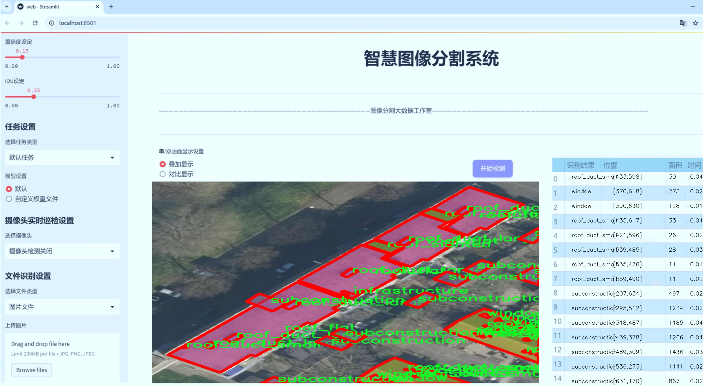

# 屋顶结构分割系统： yolov8-seg-C2f-REPVGGOREPA

### 1.研究背景与意义

[参考博客](https://gitee.com/YOLOv8_YOLOv11_Segmentation_Studio/projects)

[博客来源](https://kdocs.cn/l/cszuIiCKVNis)

研究背景与意义

随着城市化进程的加速，屋顶结构在城市建筑中扮演着越来越重要的角色。屋顶不仅是建筑物的保护层，更是城市生态系统的一部分，涉及到能源利用、雨水管理、城市热岛效应等多个方面。因此，准确地识别和分割屋顶结构，对于城市规划、建筑设计以及环境保护等领域具有重要的实际意义。近年来，深度学习技术的迅猛发展为图像分割任务提供了新的解决方案，尤其是基于卷积神经网络（CNN）的实例分割方法，展现出了优异的性能。

在众多实例分割算法中，YOLO（You Only Look Once）系列模型因其高效性和实时性而受到广泛关注。YOLOv8作为该系列的最新版本，进一步提升了模型的精度和速度，适用于复杂场景下的目标检测与分割任务。然而，尽管YOLOv8在一般场景下表现出色，但在特定领域如屋顶结构的分割中，仍然面临着一些挑战。屋顶结构的多样性和复杂性使得传统的YOLOv8模型在分割精度和细节保留方面存在不足。因此，基于改进YOLOv8的屋顶结构分割系统的研究，旨在通过优化模型架构和训练策略，提升其在屋顶结构分割任务中的表现。

本研究所使用的数据集包含1300幅图像，涵盖了11个类别，包括屋顶的各种组成部分，如平屋顶、斜屋顶、HVAC设备、窗户等。这些类别的多样性为模型的训练提供了丰富的样本，同时也增加了分割任务的复杂性。屋顶结构的多样性不仅体现在形状和尺寸上，还包括不同的材料和功能特性。因此，如何有效地利用这些数据进行模型训练，提升分割精度，是本研究的重要目标之一。

通过对YOLOv8模型的改进，我们将探索不同的网络结构、损失函数以及数据增强技术，以提高模型在屋顶结构分割任务中的表现。具体而言，我们将引入注意力机制，以增强模型对关键特征的关注，同时通过多尺度特征融合，提升模型对不同尺寸屋顶结构的识别能力。此外，利用迁移学习和自监督学习等技术，我们希望在有限的数据集上实现更好的训练效果，减少过拟合现象的发生。

本研究的意义不仅在于提升屋顶结构分割的精度，更在于为城市建筑的智能化管理提供技术支持。通过高效的屋顶结构分割系统，城市规划者和建筑设计师可以更好地进行屋顶空间的利用和改造，推动绿色建筑和可持续发展的实践。同时，该系统的研究成果也可以为其他领域的实例分割任务提供借鉴，推动计算机视觉技术在更广泛应用场景中的发展。

综上所述，基于改进YOLOv8的屋顶结构分割系统的研究，具有重要的理论价值和实际应用意义，期待通过本研究的深入开展，为屋顶结构的智能识别与管理提供新的解决方案。

### 2.图片演示




注意：本项目提供完整的训练源码数据集和训练教程,由于此博客编辑较早,暂不提供权重文件（best.pt）,需要按照6.训练教程进行训练后实现上图效果。

### 3.视频演示

[3.1 视频演示](https://www.bilibili.com/video/BV1nnz1YeEJV/)

### 4.数据集信息

##### 4.1 数据集类别数＆类别名

nc: 11
names: ['elevated_outdoor_space', 'hvac', 'infrastructure', 'roof_duct_large', 'roof_duct_medium', 'roof_duct_small', 'roof_flat', 'roof_slanted', 'subconstruction', 'thermic_pv_panel', 'window']


##### 4.2 数据集信息简介

数据集信息展示

在本研究中，我们采用了名为“rooftops”的数据集，以支持对屋顶结构的分割任务，特别是为了改进YOLOv8-seg模型的性能。该数据集专注于屋顶相关的多种结构和组件，涵盖了11个不同的类别，旨在为深度学习模型提供丰富的训练样本，以实现更高的分割精度和鲁棒性。

“rooftops”数据集的类别设计经过精心挑选，反映了现代建筑屋顶的多样性和复杂性。具体而言，这11个类别包括：高架户外空间（elevated_outdoor_space）、暖通空调设备（hvac）、基础设施（infrastructure）、大型屋顶管道（roof_duct_large）、中型屋顶管道（roof_duct_medium）、小型屋顶管道（roof_duct_small）、平屋顶（roof_flat）、斜屋顶（roof_slanted）、子结构（subconstruction）、热能光伏面板（thermic_pv_panel）以及窗户（window）。这些类别不仅涵盖了屋顶的基本结构，还包括了与建筑物功能和能效相关的重要组件，确保了数据集的全面性和实用性。

在数据集的构建过程中，研究团队通过高质量的图像采集和标注，确保每个类别的样本数量充足且具有代表性。这些图像来源于不同类型的建筑物，涵盖了城市和乡村环境，以增强模型的泛化能力。每个类别的样本均经过严格的质量控制，确保标注的准确性和一致性，从而为YOLOv8-seg模型的训练提供了坚实的基础。

为了实现高效的训练，数据集中的图像经过预处理，包括尺寸调整、归一化和数据增强等步骤。这些处理不仅提高了模型的训练效率，还增强了其对不同环境和光照条件的适应能力。此外，数据集还考虑到了不同屋顶材料和结构形式的多样性，使得模型能够在实际应用中表现出色。

在模型训练过程中，采用了分层抽样的方法，以确保每个类别在训练集和验证集中的比例合理。这种方法不仅提高了模型对少数类的识别能力，还减少了过拟合的风险。通过对“rooftops”数据集的充分利用，我们期望能够提升YOLOv8-seg在屋顶结构分割任务中的性能，使其在实际应用中能够更准确地识别和分割不同的屋顶组件。

总之，“rooftops”数据集为改进YOLOv8-seg的屋顶结构分割系统提供了丰富的样本和多样的类别选择。通过对数据集的精心设计和处理，我们相信该数据集将为未来的研究和应用提供重要的支持，推动屋顶结构分割技术的发展，并为建筑物的智能管理和维护提供更为可靠的解决方案。


### 5.项目依赖环境部署教程（零基础手把手教学）

[5.1 环境部署教程链接（零基础手把手教学）](https://www.bilibili.com/video/BV1jG4Ve4E9t/?vd_source=bc9aec86d164b67a7004b996143742dc)


[5.2 安装Python虚拟环境创建和依赖库安装视频教程链接（零基础手把手教学）](https://www.bilibili.com/video/BV1nA4VeYEze/?vd_source=bc9aec86d164b67a7004b996143742dc)

### 6.手把手YOLOV8-seg训练视频教程（零基础手把手教学）

[6.1 手把手YOLOV8-seg训练视频教程（零基础小白有手就能学会）](https://www.bilibili.com/video/BV1cA4VeYETe/?vd_source=bc9aec86d164b67a7004b996143742dc)


按照上面的训练视频教程链接加载项目提供的数据集，运行train.py即可开始训练



     Epoch   gpu_mem       box       obj       cls    labels  img_size
     1/200     0G   0.01576   0.01955  0.007536        22      1280: 100%|██████████| 849/849 [14:42<00:00,  1.04s/it]
               Class     Images     Labels          P          R     mAP@.5 mAP@.5:.95: 100%|██████████| 213/213 [01:14<00:00,  2.87it/s]
                 all       3395      17314      0.994      0.957      0.0957      0.0843

     Epoch   gpu_mem       box       obj       cls    labels  img_size
     2/200     0G   0.01578   0.01923  0.007006        22      1280: 100%|██████████| 849/849 [14:44<00:00,  1.04s/it]
               Class     Images     Labels          P          R     mAP@.5 mAP@.5:.95: 100%|██████████| 213/213 [01:12<00:00,  2.95it/s]
                 all       3395      17314      0.996      0.956      0.0957      0.0845

     Epoch   gpu_mem       box       obj       cls    labels  img_size
     3/200     0G   0.01561    0.0191  0.006895        27      1280: 100%|██████████| 849/849 [10:56<00:00,  1.29it/s]
               Class     Images     Labels          P          R     mAP@.5 mAP@.5:.95: 100%|███████   | 187/213 [00:52<00:00,  4.04it/s]
                 all       3395      17314      0.996      0.957      0.0957      0.0845


### 7.50+种全套YOLOV8-seg创新点加载调参实验视频教程（一键加载写好的改进模型的配置文件）

[7.1 50+种全套YOLOV8-seg创新点加载调参实验视频教程（一键加载写好的改进模型的配置文件）](https://www.bilibili.com/video/BV1Hw4VePEXv/?vd_source=bc9aec86d164b67a7004b996143742dc)

### YOLOV8-seg算法简介

原始YOLOv8-seg算法原理

YOLOv8-seg算法是YOLO系列中的最新版本，旨在将目标检测与实例分割相结合，提供一种高效且准确的解决方案。作为一种一阶段目标检测算法，YOLOv8-seg不仅能够识别图像中的目标，还能精确地分割出目标的轮廓，这使得它在计算机视觉领域的应用前景更加广泛。YOLOv8-seg的核心在于其创新的网络结构和高效的计算能力，使其在实时检测和分割任务中表现出色。

YOLOv8-seg的网络结构由三个主要部分组成：主干网络（backbone）、特征增强网络（neck）和检测头（head）。主干网络采用了CSP（Cross Stage Partial Networks）思想，这种设计理念通过分割网络中的特征图，减少了计算量，同时保持了特征的丰富性和多样性。CSP结构的引入，使得YOLOv8-seg在特征提取过程中更加高效，能够更好地捕捉到不同尺度和形状的目标特征。

在特征增强网络方面，YOLOv8-seg使用了PAN-FPN（Path Aggregation Network - Feature Pyramid Network）的设计，这种结构通过多尺度特征融合，提高了模型对不同尺寸目标的检测能力。PAN-FPN能够有效地将来自不同层次的特征进行融合，使得网络在处理复杂场景时，能够更好地理解目标之间的关系和背景信息，从而提高分割的精度。

YOLOv8-seg的检测头部分是其最具创新性的地方，采用了解耦头的设计，将目标分类和位置回归任务分开处理。这种解耦设计使得模型能够更专注于每个任务，从而减少了复杂场景下的分类错误和定位不准的问题。此外，YOLOv8-seg引入了Anchor-free目标检测方法，这一方法的核心在于直接预测目标的位置和大小，而不依赖于预先定义的锚框。这种方式不仅简化了模型的设计，还提高了检测的灵活性，使得YOLOv8-seg能够快速适应不同类型的目标。

在训练过程中，YOLOv8-seg使用了一种新的损失函数，这种损失函数在处理目标分割时，能够更好地平衡分类和回归的损失，从而提高模型的整体性能。通过对损失函数的优化，YOLOv8-seg能够在复杂的背景下，准确地分割出目标的边界，确保检测结果的高质量。

YOLOv8-seg在性能上也有显著提升，相比于前代模型，它在检测精度和执行速度上都表现得更加优越。其轻量化的模型设计，使得YOLOv8-seg能够在各种硬件平台上运行，包括CPU和GPU，满足实时检测的需求。这一特性使得YOLOv8-seg在嵌入式设备和移动端应用中，展现出广泛的应用潜力。

值得一提的是，YOLOv8-seg不仅支持传统的目标检测任务，还能够进行姿态评估和小目标检测。这种多功能性使得YOLOv8-seg在实际应用中，能够应对更为复杂的场景和任务需求。通过对模型结构的不断优化，YOLOv8-seg在高分辨率图像处理方面也表现出色，能够有效地捕捉到细节信息，提升分割的精度。

总的来说，YOLOv8-seg算法通过其创新的网络结构、灵活的检测方法和高效的计算能力，成为了计算机视觉领域中一款极具竞争力的模型。无论是在目标检测还是实例分割任务中，YOLOv8-seg都展现出了卓越的性能，推动了相关技术的发展与应用。随着YOLOv8-seg的不断优化和迭代，未来在智能监控、自动驾驶、医疗影像等领域的应用前景将更加广阔。


### 9.系统功能展示（检测对象为举例，实际内容以本项目数据集为准）

图9.1.系统支持检测结果表格显示

  图9.2.系统支持置信度和IOU阈值手动调节

  图9.3.系统支持自定义加载权重文件best.pt(需要你通过步骤5中训练获得)

  图9.4.系统支持摄像头实时识别

  图9.5.系统支持图片识别

  图9.6.系统支持视频识别

  图9.7.系统支持识别结果文件自动保存

  图9.8.系统支持Excel导出检测结果数据


### 10.50+种全套YOLOV8-seg创新点原理讲解（非科班也可以轻松写刊发刊，V11版本正在科研待更新）

#### 10.1 由于篇幅限制，每个创新点的具体原理讲解就不一一展开，具体见下列网址中的创新点对应子项目的技术原理博客网址【Blog】：


[10.1 50+种全套YOLOV8-seg创新点原理讲解链接](https://gitee.com/qunmasj/good)

#### 10.2 部分改进模块原理讲解(完整的改进原理见上图和技术博客链接)【如果此小节的图加载失败可以通过CSDN或者Github搜索该博客的标题访问原始博客，原始博客图片显示正常】
### YOLOv8简介
Yolov8主要借鉴了Yolov5、Yolov6、YoloX等模型的设计优点，其本身创新点不多，偏重在工程实践上，具体创新如下:
·提供了一个全新的SOTA模型（包括P5 640和P6 1280分辨率的目标检测网络和基于YOLACT的实例分割模型)。并且，基于缩放系数提供了N/S/M/IL/X不同尺度的模型，以满足不同部署平台和应用场景的需求。
●Backbone:同样借鉴了CSP模块思想，不过将Yolov5中的C3模块替换成了C2f模块，实现了进一步轻量化，同时沿用Yolov5中的SPPF模块，并对不同尺度的模型进行精心微调，不再是无脑式—套参数用于所有模型，大幅提升了模型性能。
●Neck:继续使用PAN的思想，但是通过对比YOLOv5与YOLOv8的结构图可以看到，YOLOv8移除了1*1降采样层。
●Head部分相比YOLOv5改动较大，Yolov8换成了目前主流的解耦头结构(Decoupled-Head)，将分类和检测头分离，同时也从Anchor-Based换成了Anchor-Free。
●Loss计算:使用VFLLoss作为分类损失(实际训练中使用BCE Loss);使用DFLLoss+ClOU Loss作为回归损失。
●标签分配: Yolov8抛弃了以往的loU分配或者单边比例的分配方式，而是采用Task-Aligned Assigner正负样本分配策略。
#### Yolov8网络结构
Yolov8模型网络结构图如下图所示。


#### Backbone
Yolov8的Backbone同样借鉴了CSPDarkNet结构网络结构，与Yolov5最大区别是，Yolov8使用C2f模块代替C3模块。具体改进如下:
·第一个卷积层的Kernel size从6×6改为3x3。
·所有的C3模块改为C2f模块，如下图所示，多了更多的跳层连接和额外Split操作。。Block数由C3模块3-6-9-3改为C2f模块的3-6-6-3。

### 上下文引导网络（CGNet）简介


高准确率的模型（蓝点），由图像分类网络转化而来且参数量大，因此大多不适于移动设备。
低分辨率的小模型（红点），遵循分类网络的设计方式，忽略了分割特性，故而效果不好。
#### CGNet的设计：
为了提升准确率，用cgnet探索语义分割的固有属性。对于准确率的提升，因为语义分割是像素级分类和目标定位，所以空间依赖性和上下文信息发挥了重要作用。因此，设计cg模块，用于建模空间依赖性和语义上下文信息。
- 1、cg模块学习局部特征和周围特征形成联合特征
- 2、通过逐通道重新加权（强调有用信息，压缩无用信息），用全局特征改善联合特征
- 3、在全阶段应用cg模块，以便从语义层和空间层捕捉信息。
为了降低参数量：1、深层窄网络，尽可能节约内存 2、用通道卷积


之前的网络根据框架可分三类：
- 1、FCN-shape的模型，遵循分类网络的设计，忽略了上下文信息 ESPNet、ENet、fcn
- 2、FCN-CM模型，在编码阶段后用上下文模块捕捉语义级信息 DPC、DenseASPP、DFN、PSPNet
- 3、（our）在整个阶段捕捉上下文特征
- 4、主流分割网络的下采样为五次，学习了很多关于物体的抽象特征，丢失了很多有鉴别性的空间信息，导致分割边界过于平滑，（our）仅采用三次下采样，利于保存空间信息


#### cg模块

Cg模块：
思路：人类视觉系统依赖上下文信息理解场景。
如图3,a， 如若仅关注黄色框框，很难分辨，也就是说，仅关注局部特征不容易正确识别目标的类别。 然后，如果加入了目标周围的特征，即图3,b，就很容易识别正确，所以周围特征对于语义分割是很有帮助的。在此基础上，如果进一步用整个场景的特征加以辅助，将会有更高的程度去争正确分类黄色框框的物体，如图3,c所示。 故，周围上下文和全局上下文对于提升分割精度都是有帮助的。


实现：基于此，提出cg模块，利用局部特征，周围上下文以及全局上下文。如图3,d所示。该模块共包含两个阶段。

第一步，floc( ) 局部和 fsur( )周围函数分别学习对应特征。floc( )用3x3卷积从周围8个点提取特征，对应于黄色框框；同时fsur( )用感受野更大的3x3带孔卷积学习周围上下文，对应红色框框。然后fjoi( )是指将前两路特征concat之后经BN，PReLU。此一部分是cg模块的第一步。
对于模块的第二步，fglo( )用于提取全局特征，改善联合特征。受SENet启发，全局上下文被认为是一个加权向量，用于逐通道微调联合特征，以强调有用元素、压缩无用元素。在本论文中，fglo( )用GAP产生聚合上下文特征，然后用多层感知机进一步提取全局上下文。最后，使用一个尺度层对联合特征重新加权用提取的全局上下文。
残差连接有利于学习更复杂的特征以及便于训练时梯度反向传播。两个拟设计方案，LRL局部残差连接和GRL全局残差连接，实验证明（消融实验），GRL效果更好

#### CGNet网络


原则：深、瘦（deep and thin）以节省内存。层数少，通道数少，三个下采样。

Stage1，三个标准卷积层，分辨率变成原来的1/2

Stage2和stage3，分别堆叠M和N个cg模块。该两个阶段，第一层的输入是前一阶段第一个和最后一个block的结合（how结合）利于特征重用和特征传播。

将输入图像下采样到1/4和1/8分别输入到第2和3阶段。

最后，用1x1卷积层进行分割预测。

为进一步降低参数量，局部和周围特征提取器采用了逐通道卷积。之前有的工作在逐通道卷积后采用1x1卷积用以改善通道间的信息流动，本文消融实验显示效果不好，分析：因为cg模块中提取的局部和全局特征需要保持通道独立性，所以本论文不使用1*1卷积。


### 11.项目核心源码讲解（再也不用担心看不懂代码逻辑）

#### 11.1 ultralytics\models\rtdetr\val.py

以下是经过简化和注释的核心代码部分，保留了最重要的功能和逻辑：

```python
# Ultralytics YOLO 🚀, AGPL-3.0 license

from pathlib import Path
import torch
from ultralytics.data import YOLODataset
from ultralytics.models.yolo.detect import DetectionValidator
from ultralytics.utils import ops

class RTDETRDataset(YOLODataset):
    """
    RT-DETR数据集类，继承自YOLODataset类，专为实时检测和跟踪任务设计。
    """

    def __init__(self, *args, data=None, **kwargs):
        """初始化RTDETRDataset类，调用父类构造函数。"""
        super().__init__(*args, data=data, use_segments=False, use_keypoints=False, **kwargs)

    def load_image(self, i, rect_mode=False):
        """加载数据集中索引为'i'的图像，返回图像及其调整后的尺寸。"""
        return super().load_image(i=i, rect_mode=rect_mode)

    def build_transforms(self, hyp=None):
        """构建图像变换，主要用于评估阶段。"""
        transforms = []
        # 这里可以添加图像增强的逻辑
        transforms.append(
            ops.Format(bbox_format='xywh', normalize=True)  # 格式化边界框
        )
        return transforms


class RTDETRValidator(DetectionValidator):
    """
    RTDETRValidator类，扩展自DetectionValidator类，提供专门针对RT-DETR模型的验证功能。
    """

    def build_dataset(self, img_path, mode='val', batch=None):
        """
        构建RTDETR数据集。

        Args:
            img_path (str): 图像文件夹路径。
            mode (str): 模式（训练或验证）。
            batch (int, optional): 批量大小。
        """
        return RTDETRDataset(
            img_path=img_path,
            imgsz=self.args.imgsz,
            batch_size=batch,
            augment=False,  # 不进行增强
            hyp=self.args,
            rect=False,  # 不使用矩形模式
            cache=self.args.cache or None,
            data=self.data
        )

    def postprocess(self, preds):
        """对预测结果应用非极大值抑制（NMS）。"""
        bboxes, scores = preds[0].split((4, preds[0].shape[2] - 4), dim=-1)  # 分离边界框和分数
        bboxes *= self.args.imgsz  # 将边界框缩放到原始图像尺寸
        outputs = [torch.zeros((0, 6), device=bboxes.device)] * preds[0].shape[0]  # 初始化输出

        for i, bbox in enumerate(bboxes):
            bbox = ops.xywh2xyxy(bbox)  # 转换边界框格式
            score, cls = scores[i].max(-1)  # 获取最大分数和对应类别
            pred = torch.cat([bbox, score[..., None], cls[..., None]], dim=-1)  # 合并边界框、分数和类别
            pred = pred[score.argsort(descending=True)]  # 按分数排序
            outputs[i] = pred  # 保存结果

        return outputs

    def update_metrics(self, preds, batch):
        """更新评估指标。"""
        for si, pred in enumerate(preds):
            idx = batch['batch_idx'] == si  # 获取当前批次的索引
            cls = batch['cls'][idx]  # 获取真实类别
            bbox = batch['bboxes'][idx]  # 获取真实边界框
            npr = pred.shape[0]  # 预测数量

            if npr == 0:
                continue  # 如果没有预测，跳过

            predn = pred.clone()  # 复制预测结果
            # 将预测框转换为原始图像尺寸
            predn[..., [0, 2]] *= batch['ori_shape'][si][1] / self.args.imgsz
            predn[..., [1, 3]] *= batch['ori_shape'][si][0] / self.args.imgsz

            if cls.shape[0] > 0:  # 如果有真实标签
                tbox = ops.xywh2xyxy(bbox)  # 转换真实边界框格式
                # 处理预测和真实标签，更新指标
                correct_bboxes = self._process_batch(predn.float(), torch.cat((cls, tbox), 1))

            # 保存预测结果
            if self.args.save_json:
                self.pred_to_json(predn, batch['im_file'][si])
            if self.args.save_txt:
                file = self.save_dir / 'labels' / f'{Path(batch["im_file"][si]).stem}.txt'
                self.save_one_txt(predn, self.args.save_conf, batch['ori_shape'][si], file)
```

### 代码说明：
1. **RTDETRDataset** 类：继承自 `YOLODataset`，用于加载和处理RT-DETR模型的数据集。包含加载图像和构建变换的方法。
2. **RTDETRValidator** 类：继承自 `DetectionValidator`，用于验证RT-DETR模型的性能。包括构建数据集、后处理预测结果（如NMS）和更新评估指标的方法。
3. **postprocess** 方法：对模型的预测结果进行非极大值抑制，过滤掉低置信度的边界框。
4. **update_metrics** 方法：根据预测结果和真实标签更新评估指标，支持保存预测结果到文件。

这个文件是一个用于RT-DETR（实时目标检测与跟踪）模型验证的Python脚本，主要包含两个类：`RTDETRDataset`和`RTDETRValidator`。首先，`RTDETRDataset`类继承自`YOLODataset`，用于处理RT-DETR模型所需的数据集。该类的构造函数调用了父类的构造函数，并禁用了分段和关键点的使用。`load_image`方法用于加载指定索引的图像，并返回图像及其调整后的尺寸。`build_transforms`方法用于构建数据增强的转换，主要用于评估阶段。它根据传入的超参数设置不同的转换方式，并最终返回一个包含格式化和归一化的转换列表。

接下来是`RTDETRValidator`类，它继承自`DetectionValidator`，专门为RT-DETR模型提供验证功能。该类允许构建特定于RT-DETR的数据集，并在后处理阶段应用非极大值抑制（NMS）来优化预测结果。`build_dataset`方法用于创建RT-DETR数据集，接收图像路径、模式（训练或验证）和批量大小作为参数。`postprocess`方法对预测结果应用NMS，提取边界框和分数，并将结果整理成输出格式。`update_metrics`方法用于更新评估指标，它计算预测与真实标签之间的匹配情况，并记录统计信息。

整体而言，这个文件为RT-DETR模型的验证过程提供了必要的数据处理和评估功能，确保模型在实际应用中的有效性和准确性。

#### 11.2 model.py

以下是代码中最核心的部分，并附上详细的中文注释：

```python
# -*- coding: utf-8 -*-
import cv2  # 导入OpenCV库，用于处理图像和视频
import torch  # 导入PyTorch库，用于深度学习模型的构建和训练
from ultralytics import YOLO  # 从ultralytics库中导入YOLO类，用于加载YOLO模型
from ultralytics.utils.torch_utils import select_device  # 导入选择设备的工具函数

# 根据是否有可用的GPU选择设备
device = "cuda:0" if torch.cuda.is_available() else "cpu"

# 初始化参数字典
ini_params = {
    'device': device,  # 设备类型，设置为CPU或GPU
    'conf': 0.3,  # 物体置信度阈值，低于此值的检测结果将被忽略
    'iou': 0.05,  # 非极大值抑制的IOU阈值，用于去除重叠的检测框
    'classes': None,  # 类别过滤器，None表示不过滤任何类别
    'verbose': False  # 是否打印详细信息
}

class Web_Detector:  # 定义Web_Detector类
    def __init__(self, params=None):  # 构造函数
        self.model = None  # 初始化模型为None
        self.img = None  # 初始化图像为None
        self.params = params if params else ini_params  # 使用提供的参数或默认参数

    def load_model(self, model_path):  # 加载模型的方法
        self.device = select_device(self.params['device'])  # 选择设备
        self.model = YOLO(model_path)  # 加载YOLO模型
        # 预热模型以提高后续推理速度
        self.model(torch.zeros(1, 3, 640, 640).to(self.device).type_as(next(self.model.model.parameters())))

    def preprocess(self, img):  # 图像预处理方法
        self.img = img  # 保存原始图像
        return img  # 返回处理后的图像

    def predict(self, img):  # 预测方法
        results = self.model(img, **ini_params)  # 使用模型进行预测
        return results  # 返回预测结果

    def postprocess(self, pred):  # 后处理方法
        results = []  # 初始化结果列表
        for res in pred[0].boxes:  # 遍历每个检测结果
            for box in res:  # 遍历每个边界框
                class_id = int(box.cls.cpu())  # 获取类别ID
                bbox = box.xyxy.cpu().squeeze().tolist()  # 获取边界框坐标
                bbox = [int(coord) for coord in bbox]  # 转换坐标为整数

                result = {
                    "class_name": self.names[class_id],  # 类别名称
                    "bbox": bbox,  # 边界框
                    "score": box.conf.cpu().squeeze().item(),  # 置信度
                    "class_id": class_id  # 类别ID
                }
                results.append(result)  # 将结果添加到列表
        return results  # 返回结果列表
```

### 代码说明：
1. **导入库**：引入必要的库，如OpenCV、PyTorch和YOLO模型。
2. **设备选择**：根据是否有可用的GPU选择设备。
3. **参数初始化**：定义了一些模型推理的基本参数，如置信度阈值和IOU阈值。
4. **Web_Detector类**：定义了一个检测器类，包含加载模型、预处理、预测和后处理的方法。
5. **加载模型**：`load_model`方法用于加载YOLO模型，并进行预热以提高推理速度。
6. **图像预处理**：`preprocess`方法保存输入图像。
7. **预测**：`predict`方法使用模型进行预测，返回检测结果。
8. **后处理**：`postprocess`方法对预测结果进行处理，提取出类别名称、边界框、置信度等信息，并返回结果列表。

这个程序文件 `model.py` 是一个用于物体检测的模型实现，主要依赖于 OpenCV 和 YOLO（You Only Look Once）模型。程序首先导入了必要的库和模块，包括 OpenCV、PyTorch、QtFusion 中的检测器和热图生成器、中文名称列表以及 YOLO 模型。接着，程序通过判断是否有可用的 GPU，选择计算设备（CPU 或 GPU）。

在程序中定义了一些初始化参数，如物体置信度阈值、IOU 阈值和类别过滤器等。接下来，定义了一个 `count_classes` 函数，用于统计检测结果中每个类别的数量。该函数接收检测信息和类别名称列表作为输入，返回一个包含每个类别计数的列表。

程序中还定义了一个 `Web_Detector` 类，继承自 `Detector` 抽象基类。该类的构造函数初始化了一些属性，包括模型、图像和类别名称。类中有多个方法：

- `load_model` 方法用于加载 YOLO 模型，并根据模型路径判断任务类型（分割或检测）。加载模型后，它会将类别名称转换为中文，并进行模型预热。
- `preprocess` 方法用于对输入图像进行预处理，当前实现中只是简单地返回原始图像。
- `predict` 方法用于执行模型预测，返回预测结果。
- `postprocess` 方法对预测结果进行后处理，提取每个检测框的信息，包括类别名称、边界框坐标、置信度和类别 ID，并将这些信息存储在结果列表中返回。
- `set_param` 方法用于更新检测器的参数。

整体来看，这个程序实现了一个基于 YOLO 的物体检测器，能够加载模型、处理图像、进行预测并返回检测结果，适用于需要实时物体检测的应用场景。

#### 11.3 ultralytics\data\__init__.py

以下是保留的核心代码部分，并附上详细的中文注释：

```python
# 导入基础数据集类
from .base import BaseDataset

# 导入构建数据加载器和YOLO数据集的函数
from .build import build_dataloader, build_yolo_dataset

# 导入不同类型的数据集类
from .dataset import ClassificationDataset, SemanticDataset, YOLODataset

# 定义模块的公开接口，包含可以被外部访问的类和函数
__all__ = (
    'BaseDataset',         # 基础数据集类
    'ClassificationDataset',  # 分类数据集类
    'SemanticDataset',     # 语义分割数据集类
    'YOLODataset',         # YOLO特定的数据集类
    'build_yolo_dataset',  # 构建YOLO数据集的函数
    'build_dataloader',    # 构建数据加载器的函数
    'load_inference_source' # 加载推理源的函数
)
```

### 注释说明：
1. **导入模块**：代码中通过 `from ... import ...` 语句导入了其他模块中的类和函数，以便在当前模块中使用。
2. **公开接口**：`__all__` 列表定义了当前模块对外公开的接口，只有在这个列表中的类和函数可以被外部导入。这是一种封装机制，可以控制模块的可见性。

这个程序文件是Ultralytics YOLO项目中的一个初始化文件，通常用于定义模块的公共接口。在这个文件中，首先通过注释说明了该项目的名称“Ultralytics YOLO”以及其使用的许可证类型（AGPL-3.0）。接下来，文件从当前包中导入了一些基础组件，包括`BaseDataset`类、构建数据加载器和YOLO数据集的函数，以及用于加载推理源的函数。

具体来说，`BaseDataset`是一个基础数据集类，可能用于其他数据集类的继承。`build_dataloader`函数用于构建数据加载器，`build_yolo_dataset`函数则用于构建YOLO格式的数据集，而`load_inference_source`函数可能用于加载推理所需的数据源。

此外，文件还导入了三个具体的数据集类：`ClassificationDataset`、`SemanticDataset`和`YOLODataset`，分别用于分类、语义分割和YOLO目标检测任务。这些类和函数通过`__all__`列表公开，意味着它们可以被其他模块导入使用，从而形成了该模块的公共API。

总的来说，这个文件的主要作用是组织和导出与数据集相关的类和函数，以便于在其他部分的代码中进行调用和使用。

#### 11.4 ultralytics\nn\extra_modules\block.py

以下是代码中最核心的部分，并附上详细的中文注释：

```python
import torch
import torch.nn as nn
import torch.nn.functional as F

def autopad(k, p=None, d=1):  # kernel, padding, dilation
    """自动填充以保持输出形状与输入相同。"""
    if d > 1:
        k = d * (k - 1) + 1 if isinstance(k, int) else [d * (x - 1) + 1 for x in k]  # 实际的卷积核大小
    if p is None:
        p = k // 2 if isinstance(k, int) else [x // 2 for x in k]  # 自动填充
    return p

class Conv(nn.Module):
    """自定义卷积层，包含卷积、批归一化和激活函数。"""
    def __init__(self, in_channels, out_channels, kernel_size=3, stride=1, padding=None, groups=1, act=True):
        super().__init__()
        self.conv = nn.Conv2d(in_channels, out_channels, kernel_size, stride, autopad(kernel_size, padding), groups=groups, bias=False)
        self.bn = nn.BatchNorm2d(out_channels)
        self.act = nn.ReLU() if act is True else act  # 如果需要激活函数，则使用ReLU

    def forward(self, x):
        """前向传播函数。"""
        return self.act(self.bn(self.conv(x)))  # 先卷积，再批归一化，最后激活

class Bottleneck(nn.Module):
    """标准的瓶颈块，包含两个卷积层。"""
    def __init__(self, c1, c2, shortcut=True, g=1, k=(3, 3), e=0.5):
        super().__init__()
        c_ = int(c2 * e)  # 隐藏通道数
        self.cv1 = Conv(c1, c_, k[0], 1)  # 第一个卷积层
        self.cv2 = Conv(c_, c2, k[1], 1, g=g)  # 第二个卷积层
        self.add = shortcut and c1 == c2  # 是否使用shortcut连接

    def forward(self, x):
        """前向传播函数。"""
        return x + self.cv2(self.cv1(x)) if self.add else self.cv2(self.cv1(x))  # 如果使用shortcut，则加上输入x

class DyHeadBlock(nn.Module):
    """动态头块，包含多种注意力机制。"""
    def __init__(self, in_channels, norm_type='GN', zero_init_offset=True):
        super().__init__()
        self.zero_init_offset = zero_init_offset
        self.spatial_conv_offset = nn.Conv2d(in_channels, 3 * 3 * 3, 3, padding=1)  # 用于计算偏移量和掩码
        self.spatial_conv_high = Conv(in_channels, in_channels)
        self.spatial_conv_mid = Conv(in_channels, in_channels)
        self.spatial_conv_low = Conv(in_channels, in_channels, stride=2)
        self.scale_attn_module = nn.Sequential(nn.AdaptiveAvgPool2d(1), nn.Conv2d(in_channels, 1, 1), nn.ReLU(inplace=True))

    def forward(self, x):
        """前向传播函数。"""
        outs = []
        for level in range(len(x)):
            offset_and_mask = self.spatial_conv_offset(x[level])  # 计算偏移量和掩码
            offset = offset_and_mask[:, :6, :, :]  # 偏移量
            mask = offset_and_mask[:, 6:, :, :].sigmoid()  # 掩码
            mid_feat = self.spatial_conv_mid(x[level])  # 中间特征
            sum_feat = mid_feat * self.scale_attn_module(mid_feat)  # 加权特征
            outs.append(sum_feat)  # 将特征添加到输出列表
        return outs  # 返回所有层的输出

# 以上是核心部分的代码和注释，其他模块和类可以根据需要进行相似的处理。
```

以上代码保留了最核心的部分，主要包括卷积层、瓶颈块和动态头块的实现，并附上了详细的中文注释，帮助理解每个部分的功能和作用。

这个程序文件 `ultralytics\nn\extra_modules\block.py` 主要实现了一系列用于深度学习模型的模块，特别是针对卷积神经网络（CNN）的各种结构和功能模块。以下是对文件中主要内容的说明：

首先，文件导入了必要的库，包括 PyTorch、NumPy 和一些自定义模块。然后，定义了一些工具函数，例如 `autopad` 用于自动计算卷积的填充，使得输出的特征图尺寸与输入一致。

接下来，文件中定义了多个类，主要分为以下几类：

1. **激活函数类**：如 `swish`、`h_swish` 和 `h_sigmoid`，这些类实现了不同的激活函数，用于在神经网络中引入非线性。

2. **卷积类**：如 `DyDCNv2` 和 `DyHeadBlock`，这些类实现了不同类型的卷积操作，包括可调变形卷积（Deformable Convolution）和动态头部模块（Dynamic Head），用于提高模型的特征提取能力。

3. **注意力机制类**：如 `DyReLU` 和 `GSConv`，这些类实现了注意力机制，能够根据输入特征的不同动态调整权重，从而增强模型对重要特征的关注。

4. **块结构类**：如 `Bottleneck`、`C3` 和 `C2f`，这些类实现了基本的网络块结构，通常用于构建更复杂的网络。`Bottleneck` 类实现了一个基本的瓶颈结构，而 `C3` 和 `C2f` 则实现了不同的层次结构，适用于特定的网络架构。

5. **融合模块类**：如 `Fusion` 和 `BiFusion`，这些类实现了特征融合的操作，将来自不同层或不同通道的特征进行合并，以提高模型的表现。

6. **特定结构类**：如 `ContextGuidedBlock` 和 `MSBlock`，这些类实现了特定的网络结构，旨在通过引入上下文信息或多尺度特征来增强模型的性能。

7. **动态卷积类**：如 `DCNv2` 和 `DCNv3`，这些类实现了动态卷积操作，能够根据输入特征动态调整卷积核的形状和位置，从而提高特征提取的灵活性。

文件中还定义了一些其他的模块，如 `PyramidPoolAgg`、`AdvPoolFusion` 和 `GOLDYOLO_Attention`，这些模块提供了额外的功能，进一步增强了模型的能力。

总体而言，这个文件包含了多种用于构建深度学习模型的基础模块和结构，提供了灵活的组件以便于构建复杂的神经网络架构，特别是在目标检测和图像分割等任务中具有广泛的应用。

#### 11.5 demo_test_image.py

以下是代码中最核心的部分，并附上详细的中文注释：

```python
import cv2
import numpy as np
from PIL import ImageFont, ImageDraw, Image
from hashlib import md5
from model import Web_Detector
from chinese_name_list import Label_list

def generate_color_based_on_name(name):
    # 使用哈希函数生成稳定的颜色
    hash_object = md5(name.encode())  # 对名字进行MD5哈希
    hex_color = hash_object.hexdigest()[:6]  # 取前6位16进制数作为颜色值
    r, g, b = int(hex_color[0:2], 16), int(hex_color[2:4], 16), int(hex_color[4:6], 16)  # 转换为RGB
    return (b, g, r)  # OpenCV 使用BGR格式

def draw_with_chinese(image, text, position, font_size=20, color=(255, 0, 0)):
    # 在图像上绘制中文文本
    image_pil = Image.fromarray(cv2.cvtColor(image, cv2.COLOR_BGR2RGB))  # 转换为PIL格式
    draw = ImageDraw.Draw(image_pil)  # 创建绘图对象
    font = ImageFont.truetype("simsun.ttc", font_size, encoding="unic")  # 加载中文字体
    draw.text(position, text, font=font, fill=color)  # 绘制文本
    return cv2.cvtColor(np.array(image_pil), cv2.COLOR_RGB2BGR)  # 转换回OpenCV格式

def draw_detections(image, info):
    # 绘制检测结果，包括边框、类别名称等
    name, bbox = info['class_name'], info['bbox']  # 获取类别名称和边框
    x1, y1, x2, y2 = bbox  # 解包边框坐标
    cv2.rectangle(image, (x1, y1), (x2, y2), color=(0, 0, 255), thickness=3)  # 绘制边框
    image = draw_with_chinese(image, name, (x1, y1 - 10), font_size=20)  # 绘制类别名称
    return image

def process_frame(model, image):
    # 处理每一帧图像，进行目标检测
    pre_img = model.preprocess(image)  # 预处理图像
    pred = model.predict(pre_img)  # 进行预测
    det = pred[0]  # 获取检测结果

    if det is not None and len(det):
        for info in det:  # 遍历每个检测到的对象
            image = draw_detections(image, info)  # 绘制检测结果
    return image

if __name__ == "__main__":
    model = Web_Detector()  # 创建模型实例
    model.load_model("./weights/yolov8s-seg.pt")  # 加载模型权重

    # 图片处理
    image_path = './icon/OIP.jpg'  # 指定图片路径
    image = cv2.imread(image_path)  # 读取图片
    if image is not None:
        processed_image = process_frame(model, image)  # 处理图像
        cv2.imshow('Processed Image', processed_image)  # 显示处理后的图像
        cv2.waitKey(0)  # 等待按键
        cv2.destroyAllWindows()  # 关闭窗口
    else:
        print('Image not found.')  # 图片未找到的提示
```

### 代码说明：
1. **生成颜色**：通过对名称进行MD5哈希生成稳定的颜色，确保同一名称每次生成的颜色一致。
2. **绘制中文文本**：使用PIL库在图像上绘制中文文本，确保中文字符正确显示。
3. **绘制检测结果**：在图像上绘制检测到的对象的边框和类别名称。
4. **处理每一帧**：将输入图像传入模型进行处理，获取检测结果并绘制到图像上。
5. **主程序**：加载模型并读取指定路径的图像，处理后显示结果。

这个程序文件 `demo_test_image.py` 主要用于处理图像，利用深度学习模型进行目标检测和分割，并在图像上绘制检测结果，包括目标的边界框、类别名称、面积、周长、圆度和颜色等信息。

程序首先导入了必要的库，包括 `random`、`cv2`（OpenCV）、`numpy`、`PIL`（用于处理图像和绘制文本）、`hashlib`（用于生成哈希值）、以及自定义的 `Web_Detector` 模型和 `Label_list` 类别名称列表。

接下来，定义了几个辅助函数。`generate_color_based_on_name` 函数通过对类别名称进行哈希处理，生成一个稳定的颜色值，以便在绘制时使用。`calculate_polygon_area` 函数用于计算多边形的面积，主要用于计算分割掩码的面积。`draw_with_chinese` 函数使用 PIL 库在图像上绘制中文文本，支持指定字体大小和颜色。`adjust_parameter` 函数根据图像的大小调整绘制参数，以确保在不同尺寸的图像上绘制效果一致。

`draw_detections` 函数是核心绘制函数，根据检测到的信息（如类别名称、边界框、置信度、类别 ID 和掩码）在图像上绘制相应的内容。如果没有掩码，则绘制边界框和类别名称；如果有掩码，则绘制分割区域，并计算和显示该区域的面积、周长、圆度和颜色值。该函数还处理了可能出现的异常，以确保程序的稳定性。

`process_frame` 函数负责对输入图像进行预处理、预测和后处理。它调用模型的相关方法，获取检测结果，并对每个检测到的对象调用 `draw_detections` 函数进行绘制。

在主程序部分，首先加载类别名称列表和目标检测模型，并加载预训练的权重文件。然后读取指定路径的图像，如果图像成功加载，则调用 `process_frame` 函数处理图像，并使用 OpenCV 显示处理后的图像。如果图像未找到，则输出相应的提示信息。

总体来说，这个程序实现了一个完整的目标检测和分割流程，能够在图像上直观地展示检测结果，并提供了丰富的视觉信息。

### 12.系统整体结构（节选）

### 程序整体功能和构架概括

该程序是一个基于Ultralytics YOLO框架的目标检测与分割系统，旨在实现高效的图像处理和物体识别。程序的整体架构分为多个模块，各自负责不同的功能，以便于代码的维护和扩展。主要功能包括数据集的构建与处理、模型的定义与训练、目标检测的验证、以及图像的可视化展示。

- **数据处理模块**：负责加载和处理数据集，提供数据增强和转换功能。
- **模型定义模块**：实现了各种深度学习模型的结构，包括卷积层、激活函数和注意力机制等。
- **验证模块**：用于评估模型的性能，计算各种指标，并支持后处理操作。
- **可视化模块**：处理输入图像，执行目标检测，并在图像上绘制检测结果。

### 文件功能整理表

| 文件路径                                     | 功能描述                                                                                   |
|--------------------------------------------|------------------------------------------------------------------------------------------|
| `ultralytics/models/rtdetr/val.py`        | 实现RT-DETR模型的验证功能，包括数据集的构建、后处理和评估指标的更新。                               |
| `model.py`                                 | 定义YOLO目标检测模型，包括模型加载、图像预处理、预测和后处理功能。                                   |
| `ultralytics/data/__init__.py`            | 初始化数据处理模块，导入基础数据集类和构建数据加载器的函数，定义公共API。                           |
| `ultralytics/nn/extra_modules/block.py`   | 实现各种深度学习模块，如激活函数、卷积层、注意力机制和特定网络结构，提供构建神经网络的基础组件。         |
| `demo_test_image.py`                       | 处理输入图像，利用模型进行目标检测和分割，并在图像上绘制检测结果，包括边界框和类别信息。                |

这个表格总结了每个文件的主要功能，便于理解程序的整体结构和各个模块之间的关系。

### 13.图片、视频、摄像头图像分割Demo(去除WebUI)代码

在这个博客小节中，我们将讨论如何在不使用WebUI的情况下，实现图像分割模型的使用。本项目代码已经优化整合，方便用户将分割功能嵌入自己的项目中。
核心功能包括图片、视频、摄像头图像的分割，ROI区域的轮廓提取、类别分类、周长计算、面积计算、圆度计算以及颜色提取等。
这些功能提供了良好的二次开发基础。

### 核心代码解读

以下是主要代码片段，我们会为每一块代码进行详细的批注解释：

```python
import random
import cv2
import numpy as np
from PIL import ImageFont, ImageDraw, Image
from hashlib import md5
from model import Web_Detector
from chinese_name_list import Label_list

# 根据名称生成颜色
def generate_color_based_on_name(name):
    ......

# 计算多边形面积
def calculate_polygon_area(points):
    return cv2.contourArea(points.astype(np.float32))

...
# 绘制中文标签
def draw_with_chinese(image, text, position, font_size=20, color=(255, 0, 0)):
    image_pil = Image.fromarray(cv2.cvtColor(image, cv2.COLOR_BGR2RGB))
    draw = ImageDraw.Draw(image_pil)
    font = ImageFont.truetype("simsun.ttc", font_size, encoding="unic")
    draw.text(position, text, font=font, fill=color)
    return cv2.cvtColor(np.array(image_pil), cv2.COLOR_RGB2BGR)

# 动态调整参数
def adjust_parameter(image_size, base_size=1000):
    max_size = max(image_size)
    return max_size / base_size

# 绘制检测结果
def draw_detections(image, info, alpha=0.2):
    name, bbox, conf, cls_id, mask = info['class_name'], info['bbox'], info['score'], info['class_id'], info['mask']
    adjust_param = adjust_parameter(image.shape[:2])
    spacing = int(20 * adjust_param)

    if mask is None:
        x1, y1, x2, y2 = bbox
        aim_frame_area = (x2 - x1) * (y2 - y1)
        cv2.rectangle(image, (x1, y1), (x2, y2), color=(0, 0, 255), thickness=int(3 * adjust_param))
        image = draw_with_chinese(image, name, (x1, y1 - int(30 * adjust_param)), font_size=int(35 * adjust_param))
        y_offset = int(50 * adjust_param)  # 类别名称上方绘制，其下方留出空间
    else:
        mask_points = np.concatenate(mask)
        aim_frame_area = calculate_polygon_area(mask_points)
        mask_color = generate_color_based_on_name(name)
        try:
            overlay = image.copy()
            cv2.fillPoly(overlay, [mask_points.astype(np.int32)], mask_color)
            image = cv2.addWeighted(overlay, 0.3, image, 0.7, 0)
            cv2.drawContours(image, [mask_points.astype(np.int32)], -1, (0, 0, 255), thickness=int(8 * adjust_param))

            # 计算面积、周长、圆度
            area = cv2.contourArea(mask_points.astype(np.int32))
            perimeter = cv2.arcLength(mask_points.astype(np.int32), True)
            ......

            # 计算色彩
            mask = np.zeros(image.shape[:2], dtype=np.uint8)
            cv2.drawContours(mask, [mask_points.astype(np.int32)], -1, 255, -1)
            color_points = cv2.findNonZero(mask)
            ......

            # 绘制类别名称
            x, y = np.min(mask_points, axis=0).astype(int)
            image = draw_with_chinese(image, name, (x, y - int(30 * adjust_param)), font_size=int(35 * adjust_param))
            y_offset = int(50 * adjust_param)

            # 绘制面积、周长、圆度和色彩值
            metrics = [("Area", area), ("Perimeter", perimeter), ("Circularity", circularity), ("Color", color_str)]
            for idx, (metric_name, metric_value) in enumerate(metrics):
                ......

    return image, aim_frame_area

# 处理每帧图像
def process_frame(model, image):
    pre_img = model.preprocess(image)
    pred = model.predict(pre_img)
    det = pred[0] if det is not None and len(det)
    if det:
        det_info = model.postprocess(pred)
        for info in det_info:
            image, _ = draw_detections(image, info)
    return image

if __name__ == "__main__":
    cls_name = Label_list
    model = Web_Detector()
    model.load_model("./weights/yolov8s-seg.pt")

    # 摄像头实时处理
    cap = cv2.VideoCapture(0)
    while cap.isOpened():
        ret, frame = cap.read()
        if not ret:
            break
        ......

    # 图片处理
    image_path = './icon/OIP.jpg'
    image = cv2.imread(image_path)
    if image is not None:
        processed_image = process_frame(model, image)
        ......

    # 视频处理
    video_path = ''  # 输入视频的路径
    cap = cv2.VideoCapture(video_path)
    while cap.isOpened():
        ret, frame = cap.read()
        ......
```


### 14.完整训练+Web前端界面+50+种创新点源码、数据集获取


# [下载链接：https://mbd.pub/o/bread/Z5yWlpZt](https://mbd.pub/o/bread/Z5yWlpZt)